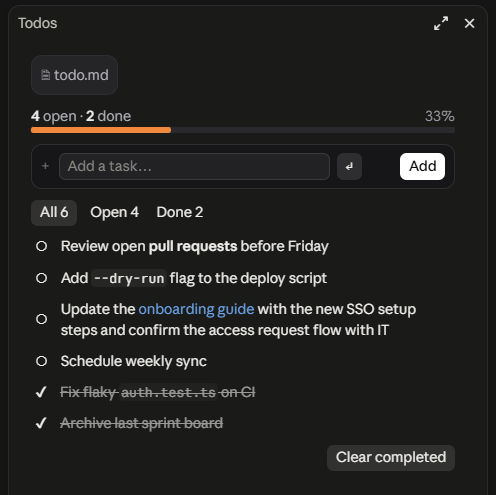

# todo-md

A Claude Code mod that turns your project's `todo.md` into a live checklist pane. Add tasks, tick them off and track progress without leaving the session, while the file stays plain Markdown that you (and Claude) can edit by hand.

<p align="center"></p>

- **Pane**: progress bar, All / Open / Done filters, one-click toggles, *Clear completed*
- **Markdown**: task text renders bold, `code` and links
- **Quick add**: `/todo <text>` from the prompt, one task per line
- **Ask Claude**: `/todo review` suggests what to start with; `/todo tidy` cleans up the file and asks before merging duplicates
- **Status line**: shows how many tasks are open in any project that has a `todo.md`
- **Stays in sync**: picks up edits made by hand or by Claude after every turn

Works in the Claude Code desktop app (Code tab) and the terminal.

## Install

In Claude Code:

```
/plugin install todo-md --marketplace ElieM90/todo-md
```

Then start a new session. Installed plugins load when a session starts.

## Usage

| Command | What it does |
| --- | --- |
| `/todo` or `/todo open` | Open the Todos pane |
| `/todo <text>` | Add a task to `todo.md` |
| `/todo` + several lines | Add one task per line (Shift+Enter for new lines) |
| `/todo review` | Claude reads `todo.md` and suggests the 1-3 tasks to start with, and flags unclear or oversized ones. It doesn't edit the file |
| `/todo tidy` | Claude normalises the checkboxes, indentation and blank lines without changing any task, then lists likely duplicates and asks you which to keep |

In the pane:

- Type in **Add a task…** and press Enter or click **Add**. Pasting several lines adds several tasks.
- Click **○** to mark a task done, **✔** to reopen it.
- Switch between **All**, **Open** and **Done** to filter.
- **Clear completed** deletes every done task from the file.

The status line under the prompt shows `☰ 3 open · /todo open`, `☰ ✓ all done`, or a hint while the list is empty. Projects without a `todo.md` show nothing.

You can also just ask Claude, e.g. *"mark the SSO task done in todo.md"* or *"what's left in todo.md?"*. The pane updates when the turn ends.

## The `todo.md` file

The mod reads and writes `todo.md` in the session's working directory and creates it on the first add. Any Markdown list line (`-`, `*`, `+` or `1.`), nested or not, counts as a task:

```markdown
# Sprint

- [ ] Review open pull requests
- [x] Archive last sprint board
- Schedule weekly sync          ← no checkbox: treated as open
* [ ] **Bold**, `code` and [links](https://example.com) render in the pane
```

- `[x]` or `[X]` means done; `[ ]` or no box means open.
- Headings, paragraphs and other lines are kept as they are and never shown.
- Lists inside fenced code blocks are ignored.
- Pasted `- [ ] `, `* ` or `1. ` prefixes are stripped when adding, so copying a list in just works.

Tip: add `todo.md` to your project's `.gitignore` if the list is personal.

## Updating

```bash
claude plugin marketplace update todo-md
```

```bash
claude plugin update todo-md@todo-md
```

Then start a new session.

## Development

```
.claude-plugin/   plugin.json (name, version) and marketplace.json
hooks/            register.tsx (/todo command, pane, status line, review/tidy prompts),
                  todos.ts (parsing and editing todo.md) and *.test.ts(x)
types/            state contract for the pane's values
```

Check and test from the repo root:

```bash
claude plugin validate .
```

```bash
claude plugin test .
```

To try changes live, copy the folder into a session's mods folder and enable hot reloading when Claude Code asks, or start a session with `claude --plugin-dir <path to this folder>`.

Bump `version` in `.claude-plugin/plugin.json` with every release. Installed copies only update when it changes.

## Changelog

**0.2.0**
- `/todo review` and `/todo tidy`
- Ticking a task finds it by its text, so edits made since the pane was drawn no longer tick the wrong one
- Text colours follow light and dark themes
- No status line in projects without a `todo.md`
- `+` and numbered lists count as tasks; lists inside code blocks are ignored

**0.1.1**: task text renders as Markdown

**0.1.0**: first release

## Limitations

- The pane is drawn with Claude Code's built-in elements, so fonts, corner radii and button colours follow the app's theme. Text colours follow your light or dark theme; the progress bar is always orange.
- The terminal shows a block-character progress bar instead of the graphic one.
- A task whose whole text is `open`, `review` or `tidy` can't be added with `/todo`; use the pane instead.
- `/todo review` and `/todo tidy` start a normal Claude turn, so they use your usage like any other prompt.
